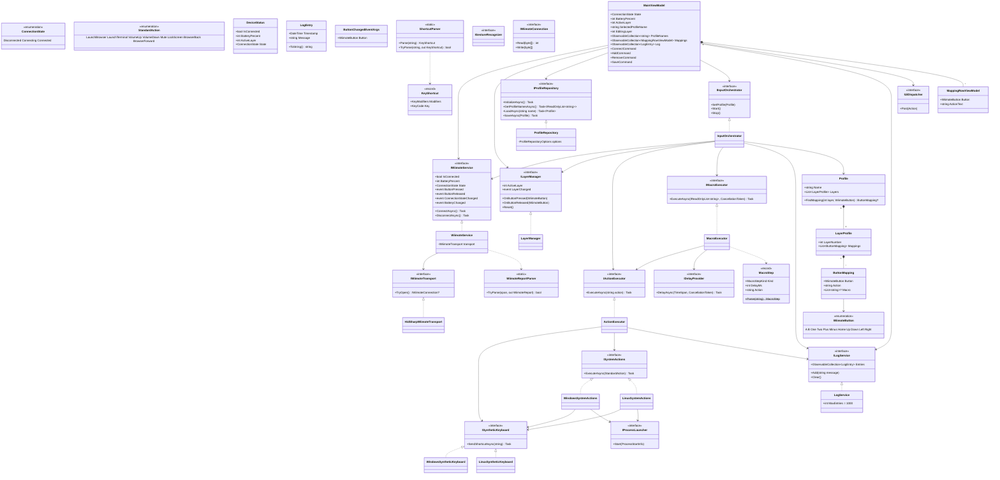

# KUNAI クラス図

```mermaid
classDiagram
direction TB

%% ===== Core / Domain =====
class WiimoteButton {
  <<enumeration>>
  A B One Two Plus Minus Home Up Down Left Right
}
class ConnectionState {
  <<enumeration>>
  Disconnected Connecting Connected
}
class StandardAction {
  <<enumeration>>
  LaunchBrowser LaunchTerminal VolumeUp VolumeDown Mute LockScreen BrowserBack BrowserForward
}
class ButtonMapping {
  +WiimoteButton Button
  +string Action
  +List~string~? Macro
}
class LayerProfile {
  +int LayerNumber
  +List~ButtonMapping~ Mappings
}
class Profile {
  +string Name
  +List~LayerProfile~ Layers
  +FindMapping(int layer, WiimoteButton) ButtonMapping?
}
class DeviceStatus {
  +bool IsConnected
  +int BatteryPercent
  +int ActiveLayer
  +ConnectionState State
}
class LogEntry {
  +DateTime Timestamp
  +string Message
  +ToString() string
}
class ButtonChangedEventArgs {
  +WiimoteButton Button
}
Profile "1" *-- "4" LayerProfile
LayerProfile "1" *-- "*" ButtonMapping
ButtonMapping --> WiimoteButton

%% ===== Core / Shortcuts =====
class KeyShortcut {
  <<record>>
  +KeyModifiers Modifiers
  +KeyCode Key
}
class ShortcutParser {
  <<static>>
  +Parse(string) KeyShortcut
  +TryParse(string, out KeyShortcut) bool
}
ShortcutParser ..> KeyShortcut

%% ===== Core / Abstractions =====
class IWiimoteService {
  <<interface>>
  +bool IsConnected
  +int BatteryPercent
  +ConnectionState State
  +ConnectAsync() Task
  +DisconnectAsync() Task
  +event ButtonPressed
  +event ButtonReleased
  +event ConnectionStateChanged
  +event BatteryChanged
}
class ILayerManager {
  <<interface>>
  +int ActiveLayer
  +OnButtonPressed(WiimoteButton)
  +OnButtonReleased(WiimoteButton)
  +Reset()
  +event LayerChanged
}
class ISyntheticKeyboard {
  <<interface>>
  +SendShortcutAsync(string) Task
}
class ISystemActions {
  <<interface>>
  +ExecuteAsync(StandardAction) Task
}
class IActionExecutor {
  <<interface>>
  +ExecuteAsync(string action) Task
}
class IMacroExecutor {
  <<interface>>
  +ExecuteAsync(IReadOnlyList~string~, CancellationToken) Task
}
class IDelayProvider {
  <<interface>>
  +DelayAsync(TimeSpan, CancellationToken) Task
}
class IProfileRepository {
  <<interface>>
  +InitializeAsync() Task
  +GetProfileNamesAsync() Task~IReadOnlyList~string~~
  +LoadAsync(string name) Task~Profile~
  +SaveAsync(Profile) Task
}
class ILogService {
  <<interface>>
  +ObservableCollection~LogEntry~ Entries
  +Add(string message)
  +Clear()
}
class IInputOrchestrator {
  <<interface>>
  +SetProfile(Profile)
  +Start()
  +Stop()
}
class IProcessLauncher {
  <<interface>>
  +Start(ProcessStartInfo)
}
class IUiDispatcher {
  <<interface>>
  +Post(Action)
}
class IGestureRecognizer {
  <<interface>>
}

%% ===== Core / Services =====
class LayerManager
class ProfileRepository {
  -ProfileRepositoryOptions options
}
class LogService {
  +int MaxEntries = 1000
}
class InputOrchestrator
ILayerManager <|.. LayerManager
IProfileRepository <|.. ProfileRepository
ILogService <|.. LogService
IInputOrchestrator <|.. InputOrchestrator
InputOrchestrator --> IWiimoteService
InputOrchestrator --> ILayerManager
InputOrchestrator --> IActionExecutor
InputOrchestrator --> IMacroExecutor
InputOrchestrator --> ILogService
InputOrchestrator --> Profile

%% ===== Input =====
class WiimoteService {
  -IWiimoteTransport transport
}
class IWiimoteTransport {
  <<interface>>
  +TryOpen() IWiimoteConnection?
}
class IWiimoteConnection {
  <<interface>>
  +Read(byte[]) int
  +Write(byte[])
}
class HidSharpWiimoteTransport
class WiimoteReportParser {
  <<static>>
  +TryParse(span, out WiimoteReport) bool
}
IWiimoteService <|.. WiimoteService
IWiimoteTransport <|.. HidSharpWiimoteTransport
WiimoteService --> IWiimoteTransport
WiimoteService ..> WiimoteReportParser

%% ===== Actions =====
class ActionExecutor
class MacroExecutor
class MacroStep {
  <<record>>
  +MacroStepKind Kind
  +int DelayMs
  +string Action
  +Parse(string)$ MacroStep
}
IActionExecutor <|.. ActionExecutor
IMacroExecutor <|.. MacroExecutor
ActionExecutor --> ISyntheticKeyboard
ActionExecutor --> ISystemActions
ActionExecutor --> ILogService
MacroExecutor --> IActionExecutor
MacroExecutor --> IDelayProvider
MacroExecutor ..> MacroStep

%% ===== Platform =====
class WindowsSyntheticKeyboard
class WindowsSystemActions
class LinuxSyntheticKeyboard
class LinuxSystemActions
WindowsSystemActions --> ISyntheticKeyboard
LinuxSystemActions --> ISyntheticKeyboard
WindowsSystemActions --> IProcessLauncher
LinuxSystemActions --> IProcessLauncher
ISyntheticKeyboard <|.. WindowsSyntheticKeyboard
ISyntheticKeyboard <|.. LinuxSyntheticKeyboard
ISystemActions <|.. WindowsSystemActions
ISystemActions <|.. LinuxSystemActions

%% ===== UI =====
class MainViewModel {
  +ConnectionState State
  +int BatteryPercent
  +int ActiveLayer
  +string SelectedProfileName
  +int EditingLayer
  +ObservableCollection~string~ ProfileNames
  +ObservableCollection~MappingRowViewModel~ Mappings
  +ObservableCollection~LogEntry~ Log
  +ConnectCommand
  +AddCommand
  +RemoveCommand
  +SaveCommand
}
class MappingRowViewModel {
  +WiimoteButton Button
  +string ActionText
}
MainViewModel --> IWiimoteService
MainViewModel --> ILayerManager
MainViewModel --> IProfileRepository
MainViewModel --> IInputOrchestrator
MainViewModel --> ILogService
MainViewModel --> IUiDispatcher
MainViewModel "1" *-- "*" MappingRowViewModel
```
